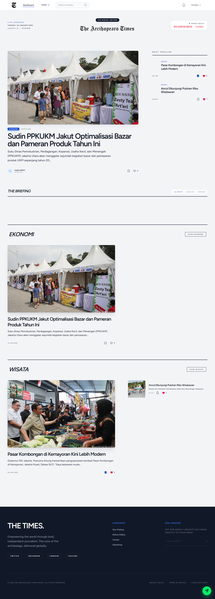

<div align="center">

# Blog-Mini

### Modern Blog Platform with Laravel & Livewire

[](https://laravel.com)
[](https://livewire.laravel.com)
[](https://tailwindcss.com)
[](https://php.net)

*A feature-rich, modern blogging platform built with the latest Laravel ecosystem*

[Features](#-features) • [Installation](#-installation) • [Usage](#-usage) • [Tech Stack](#-tech-stack) • [Contributing](#-contributing)

</div>

---

## ✨ Features

### 🎯 Core Functionality
- **📰 Article Management** - Full CRUD operations for blog posts with rich content support
- **💬 Comments System** - Nested comments with reply functionality
- **👍 Reactions** - Like/Dislike system for articles
- **🚩 Reporting** - User-driven content moderation through article reports
- **🏷️ Categories** - Organize content with category management
- **👤 User Profiles** - Customizable user profiles with authentication
- **🤖 AI Agent** - Smart assistant with context-aware responses

### 🔐 Authentication & Authorization
- **Multi-role System** - User, Admin, and Super Admin roles
- **Laravel Fortify** - Secure authentication with email verification
- **Protected Routes** - Role-based access control for sensitive operations
- **🛡️ Spam Protection** - Google reCAPTCHA v2 implementation

### 🎨 Modern UI/UX
- **Livewire Components** - Reactive, dynamic interfaces without page reloads
- **Flux UI** - Beautiful, pre-built Livewire components
- **TailwindCSS 4.x** - Modern, utility-first styling
- **Responsive Design** - Mobile-first approach for all devices
- **Dark Mode Ready** - Eye-friendly interface options

### 🛠️ Admin Features
- **Super Admin Dashboard** - Comprehensive user management
- **User Ban/Unban** - Moderation tools for community management
- **Report Management** - Review and handle user-reported content
- **Category Management** - Create and organize content categories
- **Settings Panel** - Centralized configuration management

### 🌟 Additional Features
- **Bitcoin Price Widget** - Real-time BTC price display on homepage
- **SEO Optimized** - Meta tags and semantic HTML structure
- **Error Pages** - Custom, aesthetic error pages (401, 403, 404, 500, etc.)
- **Testing Suite** - Pest PHP for reliable test coverage

---

## 🚀 Installation

### Prerequisites

Make sure you have the following installed:
- **PHP** >= 8.2
- **Composer** >= 2.x
- **Node.js** >= 18.x
- **NPM** or **Yarn**
- **MySQL** / **PostgreSQL** / **SQLite**

### Quick Setup

1. **Clone the repository**
   ```bash
   git clone https://github.com/KanakaPutra/Blog-Mini.git
   cd Blog-Mini
   ```

2. **Install dependencies**
   ```bash
   composer install
   npm install
   ```

3. **Environment setup**
   ```bash
   cp .env.example .env
   php artisan key:generate
   ```

4. **Configure your database**
   
   Edit `.env` file with your database credentials:
   ```env
   DB_CONNECTION=mysql
   DB_HOST=127.0.0.1
   DB_PORT=3306
   DB_DATABASE=blog_mini
   DB_USERNAME=root
   DB_PASSWORD=
   ```

5. **Run migrations**
   ```bash
   php artisan migrate
   ```

6. **Seed the database** (Optional)
   ```bash
   php artisan db:seed
   ```

7. **Build assets**
   ```bash
   npm run build
   ```

---

## 🎮 Usage

### Development Mode

Run the development server with hot reload:

```bash
composer dev
```

This will start:
- 🌐 Laravel server on `http://localhost:8000`
- 🔄 Queue worker for background jobs
- ⚡ Vite dev server for hot module replacement

Or run them separately:

```bash
# Terminal 1 - Laravel server
php artisan serve

# Terminal 2 - Vite dev server
npm run dev

# Terminal 3 - Queue worker (optional)
php artisan queue:listen
```

### Production Build

```bash
npm run build
php artisan optimize
```

### Testing

Run the test suite:

```bash
composer test
# or
php artisan test
```

---

## 🏗️ Tech Stack

### Backend
- **[Laravel 12](https://laravel.com)** - The PHP Framework for Web Artisans
- **[Livewire 3](https://livewire.laravel.com)** - Full-stack framework for Laravel
- **[Laravel Fortify](https://laravel.com/docs/fortify)** - Backend authentication scaffolding
- **[Flux](https://flux.laravel.com)** - Premium Livewire components
- **[Google Gemini](https://deepmind.google/technologies/gemini/)** - AI Model for Chat Assistant

### Frontend
- **[TailwindCSS 4](https://tailwindcss.com)** - Utility-first CSS framework
- **[Alpine.js](https://alpinejs.dev)** - Lightweight JavaScript framework
- **[Vite](https://vitejs.dev)** - Next generation frontend tooling

### Testing
- **[Pest PHP](https://pestphp.com)** - Elegant PHP testing framework

### Development Tools
- **[Laravel Pint](https://laravel.com/docs/pint)** - Code style fixer
- **[Laravel Sail](https://laravel.com/docs/sail)** - Docker development environment
- **[Concurrently](https://www.npmjs.com/package/concurrently)** - Run multiple commands concurrently

---

## 📁 Project Structure

```
blog-mini/
├── app/
│   ├── Actions/          # Custom action classes
│   ├── Http/
│   │   ├── Controllers/  # Application controllers
│   │   └── Middleware/   # Custom middleware
│   ├── Livewire/         # Livewire components
│   ├── Models/           # Eloquent models
│   │   ├── Article.php
│   │   ├── Category.php
│   │   ├── Comment.php
│   │   ├── ArticleLike.php
│   │   ├── ArticleReport.php
│   │   └── User.php
│   └── View/             # View composers
├── database/
│   ├── factories/        # Model factories
│   ├── migrations/       # Database migrations
│   └── seeders/          # Database seeders
├── resources/
│   ├── css/              # Stylesheets
│   ├── js/               # JavaScript files
│   └── views/            # Blade templates
│       ├── articles/     # Article views
│       ├── auth/         # Authentication views
│       ├── components/   # Reusable components
│       └── layouts/      # Layout templates
├── routes/
│   ├── web.php           # Web routes
│   ├── auth.php          # Authentication routes
│   └── console.php       # Console routes
└── tests/                # Test files
```

---

## 🔑 Key Features Explained

### Article System
Create, read, update, and delete blog articles with:
- Rich text content
- Thumbnail images
- Category assignment
- Author attribution
- Like/Dislike reactions
- Comment threads
- Report functionality

### User Roles

| Role | Permissions |
|------|------------|
| **User** | Read articles, comment, like/dislike, report content |
| **Admin** | All user permissions + Create/Edit/Delete own articles |
| **Super Admin** | All admin permissions + User management, category management, view reports |

### Comment System
- Nested comments (parent-child relationship)
- Edit and delete own comments
- Real-time updates with Livewire
- Author attribution

### 🤖 AI Powered Chat
- **Context Aware** - Understands blog content (articles, categories, stats-
- **Smart Responses** - Powered by Google Gemini 2.0 Flash
- **Admin Commands** - Voice-like commands for Super Admin to manage categories (Create/Edit/Delete)

---

## 🎨 Screenshots



---

## 🤝 Contributing

Contributions are welcome! Please feel free to submit a Pull Request.

1. Fork the project
2. Create your feature branch (`git checkout -b feature/AmazingFeature`)
3. Commit your changes (`git commit -m 'Add some AmazingFeature'`)
4. Push to the branch (`git push origin feature/AmazingFeature`)
5. Open a Pull Request

---

## 📝 License

This project is open-sourced software licensed under the [MIT license](https://opensource.org/licenses/MIT).

---

## 👨‍💻 Author

**KanakaPutra**

- GitHub: [@KanakaPutra](https://github.com/KanakaPutra)

---

## 🙏 Acknowledgments

- [Laravel](https://laravel.com) - The amazing PHP framework
- [Livewire](https://livewire.laravel.com) - For making reactive interfaces simple
- [TailwindCSS](https://tailwindcss.com) - For the beautiful utility-first CSS
- [Alternative.me API](https://alternative.me) - For Bitcoin price data

---

<div align="center">

### ⭐ Star this repo if you find it helpful!

Made with ❤️ by KanakaPutra

</div>
